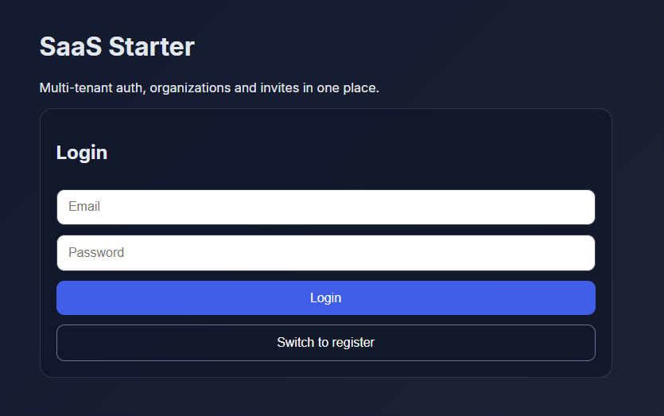
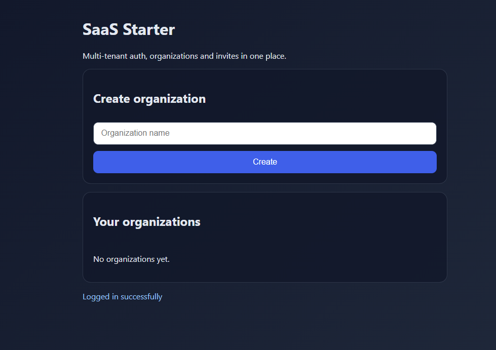

# SaaS Starter Kit — Multi-Tenant Auth & Permissions


A starter kit for building **multi-tenant SaaS applications** with **FastAPI**, **React**, JWT authentication, organization-based access control, invitations, and tenant isolation.

---

## ✨ Features

- ✅ JWT Authentication
- ✅ User Registration & Login
- ✅ Multi-Tenant Architecture
- ✅ Organization Management
- ✅ Membership Management
- ✅ Invite Users to Organizations
- ✅ Tenant Data Isolation
- ✅ Role-Based Access Control (RBAC)
- ✅ Async SQLAlchemy
- ✅ Alembic Database Migrations
- ✅ Docker & Docker Compose
- ✅ React + Vite Frontend

---

## 📸 Screenshots

### Login



### Dashboard



---

## 🛠 Tech Stack

### Backend

- FastAPI
- SQLAlchemy 2.0 (Async)
- Pydantic
- Alembic
- JWT Authentication
- Passlib (Password Hashing)

### Frontend

- React
- Vite

### Database

- SQLite (development)
- Ready for PostgreSQL

### DevOps

- Docker
- Docker Compose

---

## 📁 Project Structure

```
backend/
    app/
    tests/
    Dockerfile

frontend/
docker-compose.yml
README.md
```

---

## 🚀 Run Locally

### Backend

```bash
cd backend
pip install -r requirements.txt
python -m uvicorn app.main:app --reload --host 127.0.0.1 --port 8001
```

### Frontend

```bash
cd frontend
npm install
npm run dev -- --host 127.0.0.1 --port 3000
```

### Docker

```bash
docker compose up --build
```

---

## 🔑 Demo Credentials

```
Email: demo@example.com
Password: secret123
```

---

## 🧪 Running Tests

```bash
cd backend
pytest
```

---

## 🗺 Roadmap

- PostgreSQL support
- Complete Alembic migrations
- CI/CD with GitHub Actions
- Automated tests expansion
- Billing module
- Admin dashboard
- Organization roles & permissions
- Email invitation workflow
- Production deployment

---

## 📌 About

This project was created as a practical foundation for building **modern multi-tenant SaaS applications**. It demonstrates concepts commonly used in production systems, including authentication, tenant isolation, organization management, invitations, and scalable backend architecture.