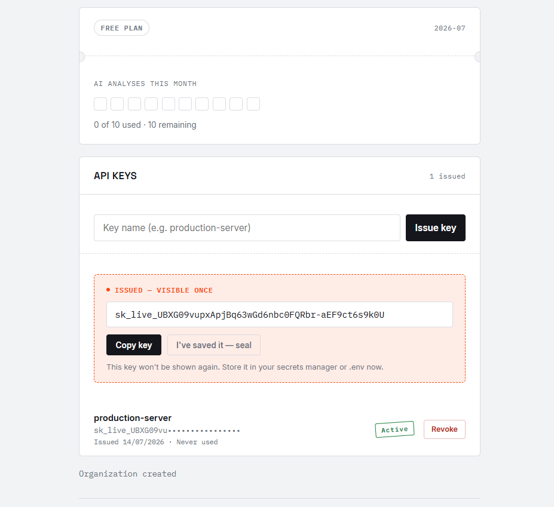
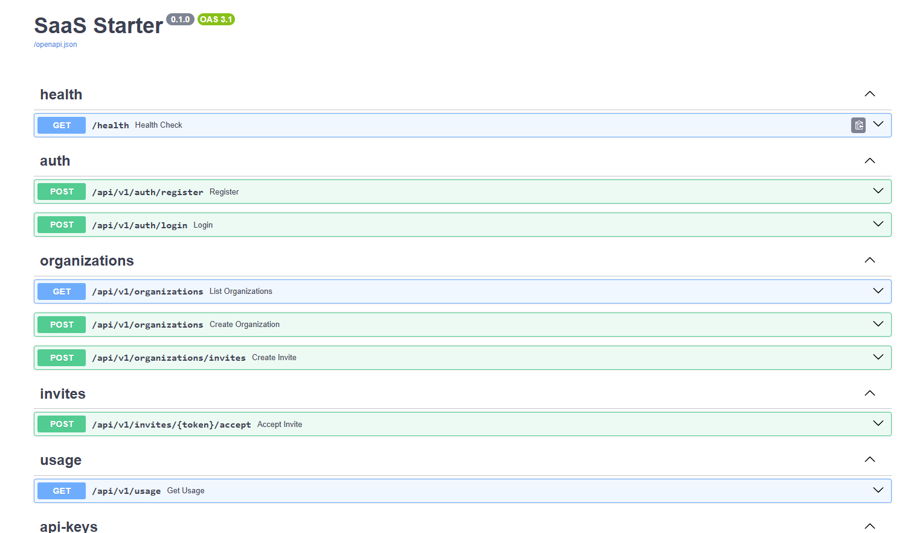

# SaaS Starter Kit — Multi-Tenant Auth & Permissions


Um starter para aplicações SaaS multi-tenant, com foco em autenticação, isolamento de dados entre organizações, controle de acesso baseado em papéis (RBAC), cotas de uso por plano e emissão segura de chaves de API.

O objetivo é construir uma base sólida usando conceitos presentes em aplicações SaaS modernas — arquitetura organizada, segura e preparada para evoluir.

> 🚧 Projeto em desenvolvimento ativo. Feedbacks e sugestões são sempre bem-vindos!

📸 Preview 

## Login


## Dashboard


## Usage & Quotas



## API Keys



## ✅ O que o projeto já oferece

- Arquitetura multi-tenant com isolamento de dados por organização
- Autenticação segura utilizando JWT (access token de vida curta + refresh token opaco e revogável)
- Backend assíncrono com **FastAPI** + **SQLAlchemy 2.0 (Async)**
- Frontend desenvolvido com **React** + **Vite**
- Gerenciamento de organizações, memberships e convites de usuários
- Sistema de convites com:
  - token único
  - expiração
  - validação e aceite do convite
- Controle de acesso baseado em papéis (RBAC):
  - `Owner`
  - `Admin`
  - `Member`
- Administradores podem convidar novos membros
- **Cotas de uso por plano** — cada organização tem um plano (`free`, `pro`) com limite mensal de uso de uma feature, calculado por período corrente e bloqueando a ação ao atingir o limite
- **API Keys** — emissão de chaves (`sk_live_...`) para autenticação de integrações externas:
  - a chave completa só é exibida uma única vez, no momento da criação
  - apenas o hash (SHA-256) é persistido — a chave nunca pode ser recuperada, somente revogada
  - listagem mostra só o prefixo mascarado, nunca a chave completa
  - revogação idempotente (chamar revoke em uma chave já revogada não gera erro)
- Auditoria básica registrando eventos como:
  - criação de organizações
  - criação de convites
  - aceite de convites
  - emissão e revogação de API Keys
- Schema do banco gerenciado inteiramente pelo **Alembic** — o servidor não recria mais as tabelas automaticamente no boot (uma decisão de segurança: evita perda acidental de dados a cada restart)
- **Integração contínua (CI)** — workflow do GitHub Actions que roda a suíte de testes automaticamente a cada `push` e `pull request` na branch `main`, aplicando as migrations via Alembic antes dos testes

---

## 🔎 Evidência verificada

A suíte de testes do backend foi executada com sucesso:

```bash
pytest -q
```

**Resultado:** ✅ 9 testes passaram

Os testes validam os principais fluxos implementados, incluindo:
- isolamento de dados entre organizações
- regras de autorização por role
- criação e aceitação de convites
- bloqueio de uso ao atingir a cota mensal

A cada `push` ou `pull request` para `main`, esses mesmos testes rodam automaticamente via GitHub Actions — o badge no topo deste README reflete o status em tempo real.

---

## 🛠️ Stack utilizada

**Backend**
- Python
- FastAPI
- SQLAlchemy 2.0 (Async)
- JWT (`python-jose`)
- Pytest
- Alembic (migrations — única fonte de verdade do schema)
- SQLite (desenvolvimento) / PostgreSQL (produção)

**Frontend**
- React
- Vite
- Sistema de design próprio (CSS puro, sem framework de UI): paleta neutra fria com um único accent de sinalização, tipografia Space Grotesk + IBM Plex Mono

**DevOps**
- GitHub Actions (CI — testes automatizados a cada push/PR)

---

## 📂 Estrutura do projeto

```
.
├── .github/
│   └── workflows/
│       └── ci.yml               # pipeline de CI (testes automatizados)
├── backend/
│   ├── app/
│   │   ├── api/
│   │   │   ├── deps.py           # autenticação compartilhada (get_authenticated_email)
│   │   │   └── routes/           # endpoints (auth, organizations, invites, usage, api_keys, health)
│   │   ├── core/                 # config e segurança (JWT, refresh token, API keys, hashing)
│   │   ├── models/                # models SQLAlchemy (User, Organization, Membership, Invite, UsageRecord, ApiKey, ...)
│   │   ├── schemas/               # schemas Pydantic
│   │   ├── services/               # regras de negócio (quota, state) e acesso a dados
│   │   └── main.py
│   ├── alembic/                    # migrations (fonte única de verdade do schema)
│   ├── tests/
│   └── requirements.txt
├── frontend/
│   ├── src/
│   │   ├── App.jsx
│   │   ├── UsagePanel.jsx         # painel de cotas de uso
│   │   ├── ApiKeysPanel.jsx       # painel de emissão/revogação de API Keys
│   │   └── styles.css
│   ├── index.html
│   └── package.json
└── docker-compose.yml
```

---

## 🚀 Rodando localmente

### Pré-requisitos
- Python 3.11+
- Node.js 18+

### Backend

```bash
cd backend
python -m venv .venv
.venv\Scripts\activate      # Windows
# source .venv/bin/activate # Linux/Mac

pip install -r requirements.txt
alembic upgrade head         # aplica o schema — obrigatório antes do primeiro start
uvicorn app.main:app --reload
```

O backend sobe em `http://127.0.0.1:8000`. Documentação interativa (Swagger) disponível em `http://127.0.0.1:8000/docs`.

Um usuário de demonstração é criado automaticamente ao iniciar o servidor:

```
email: demo@example.com
senha: secret123
```

### Frontend

```bash
cd frontend
npm install
npm run dev
```

O frontend sobe em `http://localhost:3000`.

> ⚠️ Backend e frontend precisam estar rodando **ao mesmo tempo**, em terminais separados. O CORS já está configurado para aceitar requisições vindas de `http://localhost:3000`.

### Testes

```bash
cd backend
pytest -q
```

### CI/CD

O projeto conta com um workflow de integração contínua (`.github/workflows/ci.yml`) que, a cada `push` ou `pull request` na branch `main`:

1. Faz checkout do código
2. Configura o Python 3.11 com cache de dependências
3. Instala as dependências do `backend/requirements.txt`
4. Aplica as migrations com `alembic upgrade head`
5. Roda a suíte de testes com `pytest -q`

Como todas as configurações em `Settings` têm valores default (incluindo `database_url` apontando para SQLite), o workflow roda de ponta a ponta sem precisar de secrets ou variáveis de ambiente adicionais.

---

## 🔹 Próximos passos

- [ ] Migração para PostgreSQL em produção
- [ ] Docker e Docker Compose completos
- [x] Pipeline de CI/CD com GitHub Actions
- [ ] Expansão da cobertura de testes (incluindo o fluxo completo de API Keys)
- [ ] Rate limiting por API Key
- [ ] Escopos/permissões granulares por chave (hoje uma chave tem acesso total à organização)
- [ ] Sistema de permissões mais granular, independente das roles
- [ ] Evolução do sistema de convites (reenvio, recusa, notificações por e-mail e histórico)
- [ ] Auditoria mais robusta e consultável

---

## 🧠 Sobre o projeto

O projeto ainda está em desenvolvimento, mas já evoluiu para uma base próxima da arquitetura utilizada em aplicações SaaS reais, explorando conceitos como multi-tenancy, autenticação, autorização, cotas de uso por plano, emissão segura de credenciais e boas práticas de backend.

Duas decisões técnicas que valeram a pena destacar:

- **Refresh token e API Keys não são JWT** — são valores aleatórios de alta entropia, persistidos apenas como hash. Isso permite revogação imediata (algo que um JWT sozinho não garante bem, já que é válido até expirar) e elimina o risco de um segredo em texto puro vazar do banco.
- **O schema do banco é gerenciado só pelo Alembic** — numa versão anterior, o próprio app recriava as tabelas a cada subida do servidor, um atalho conveniente em desenvolvimento solo mas destrutivo em qualquer ambiente real. Corrigido para que toda mudança de schema passe por uma migração versionada.

---

`#Python` `#FastAPI` `#React` `#Vite` `#SQLAlchemy` `#JWT` `#RBAC` `#SaaS` `#Backend` `#SoftwareEngineering` `#APIs` `#MultiTenant` `#Docker` `#PostgreSQL` `#GitHub` `#OpenSource` `#WebDevelopment`